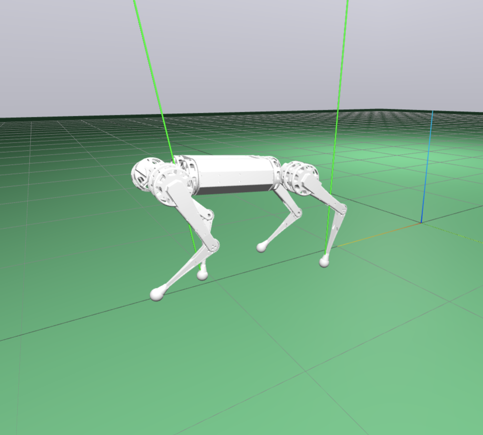
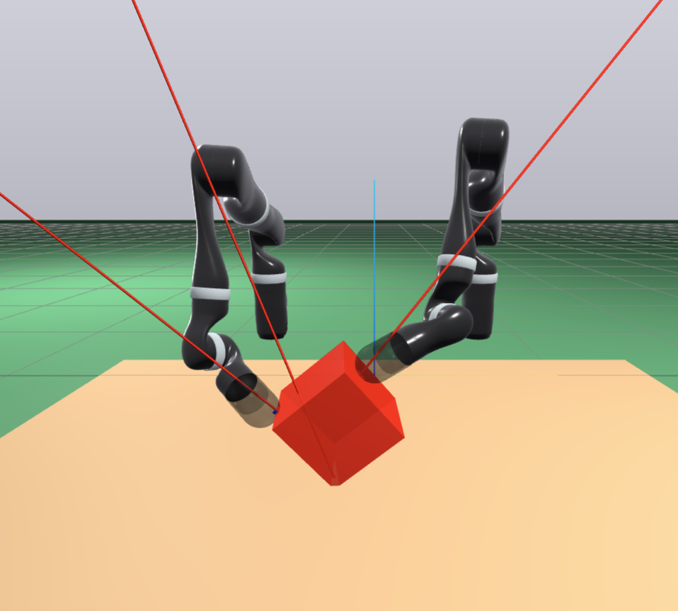
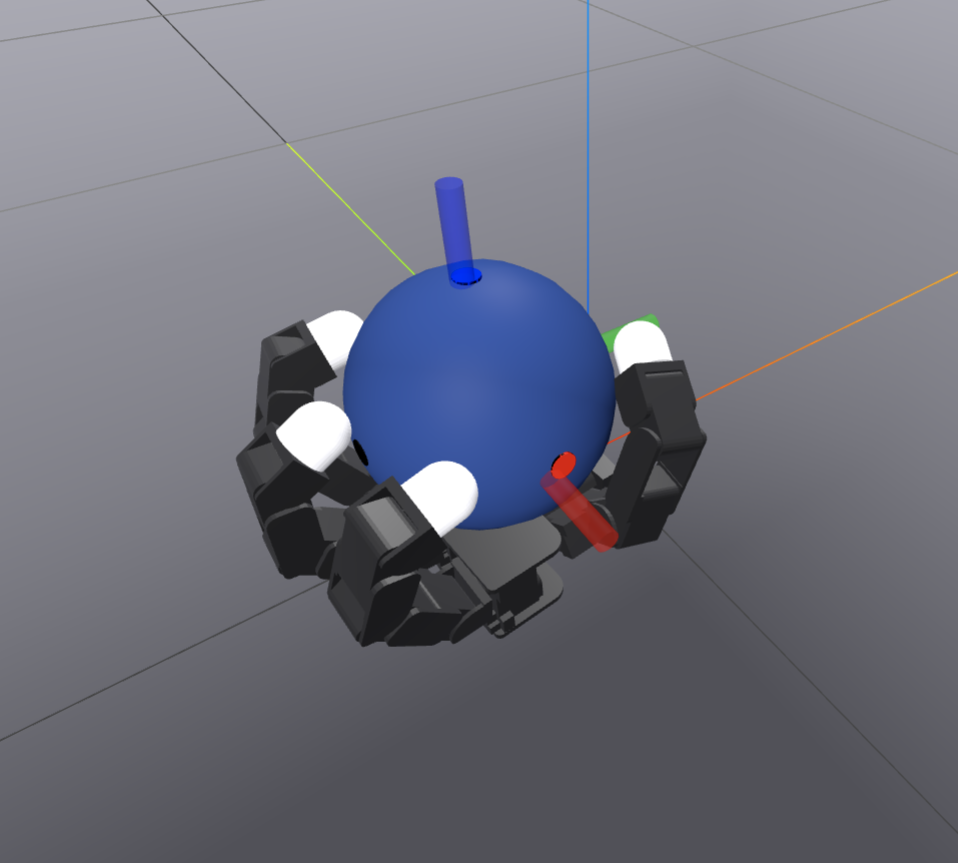
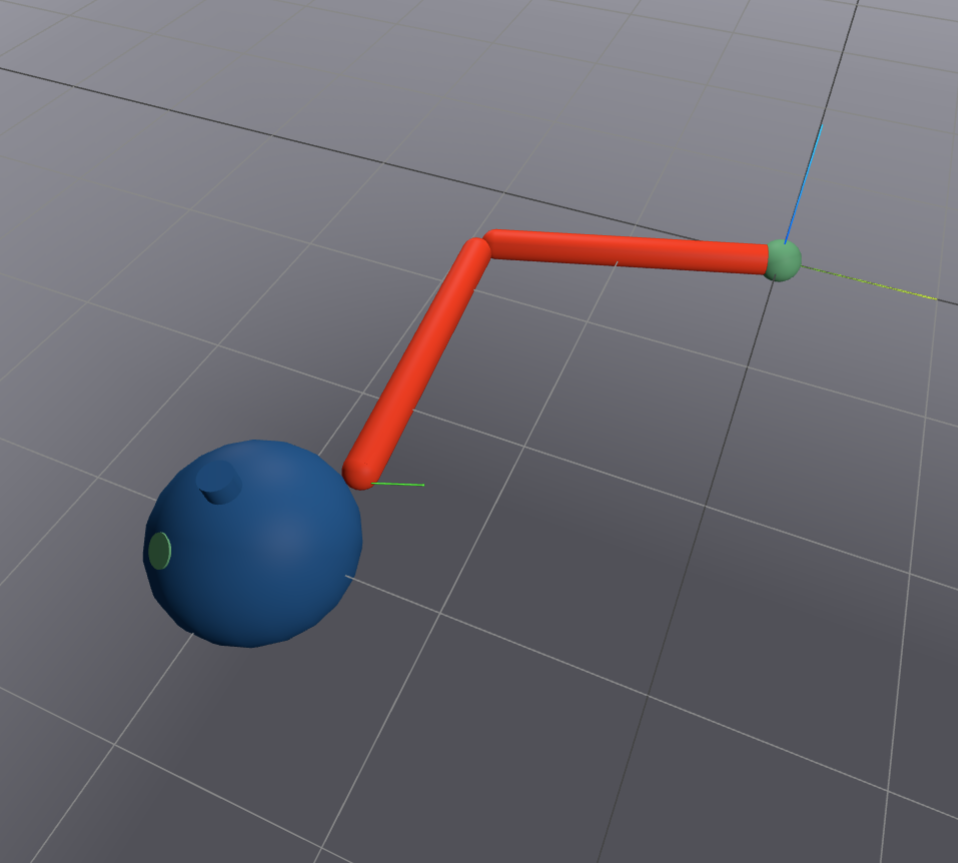
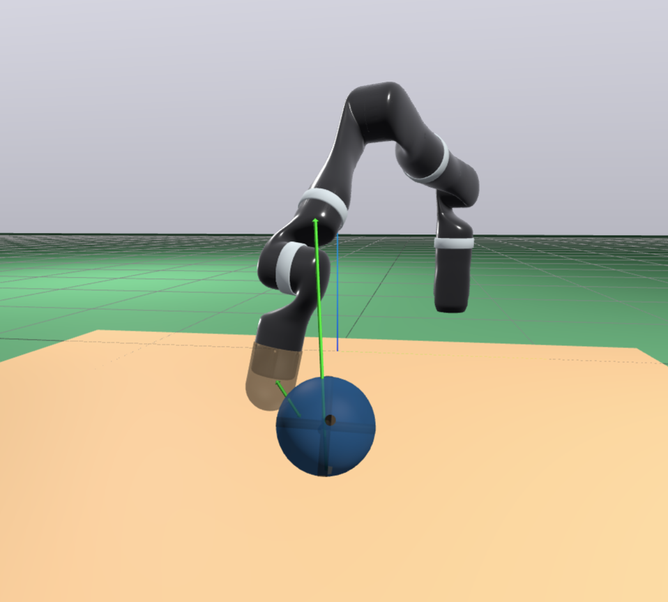
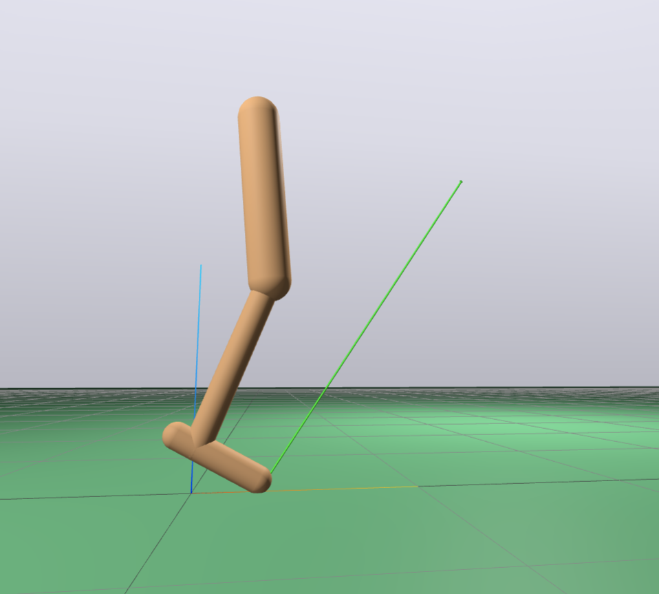
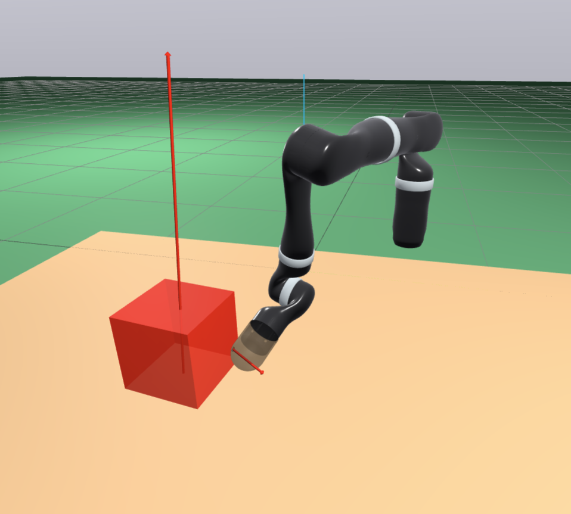
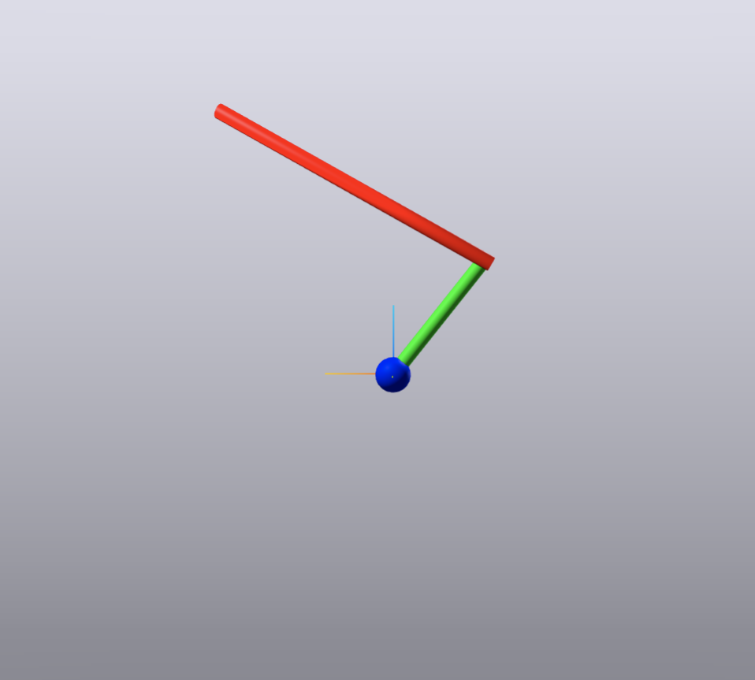
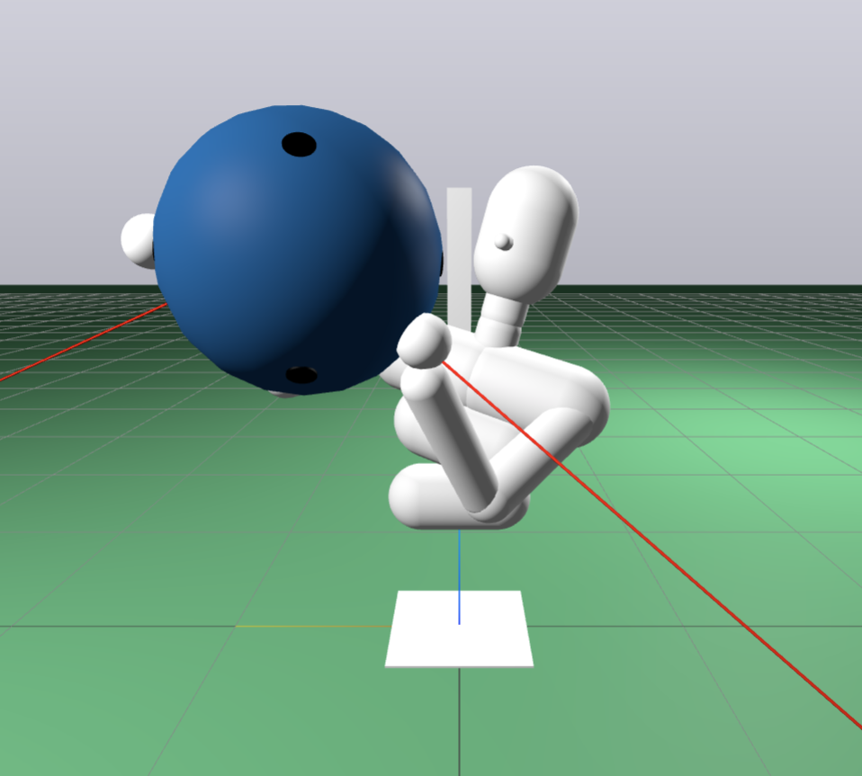

# Inverse Dynamics Trajectory Optimization 

Implements the contact-implicit trajectory optimization algorithm described in 

[Inverse Dynamics Trajectory Optimization for Contact-Implicit Model Predictive
Control](https://idto.github.io/) by Vince Kurtz, Alejandro Castro, Aykut Özgün
Önol, and Hai Lin. https://arxiv.org/abs/2309.01813.







## Docker Quickstart

Clone this repository:

```bash
git clone https://github.com/ToyotaResearchInstitute/idto/
cd idto
```

Build the docker image, which compiles the C++ bindings.

```bash
docker build -t idto .
```

Enter the docker container, forwarding
port 7000 for meshcat visualization:

```bash
docker run -p 7000:7000 -it idto
```

Inside the container, you can run any of the examples, for instance:
```bash
# Quadruped locomotion
$ ./build/examples/mini_cheetah/mini_cheetah

# Bi-manual box manipulation
$ ./build/examples/dual_jaco/dual_jaco

# A robot hand rotates a sphere
$ ./build/examples/allegro_hand/allegro_hand

# A two-link finger flicks a spinner
$ ./build/examples/spinner/spinner

# A robot arm rolls a ball
$ ./build/examples/jaco_ball/jaco_ball

# A simple planar hopping robot
$ ./build/examples/hopper/hopper

# Pendulum swingup
$ ./build/examples/pendulum/pendulum

# Acrobot swingup
$ ./build/examples/acrobot/acrobot

# Single arm box manipulation
$ ./build/examples/jaco/jaco

# A compliant humanoid lifts a large ball
$ ./build/examples/punyo/punyo
```

Open a web browser to http://localhost:7000 to see the visualization.

## Local Installation

The only dependency is [Drake](https://drake.mit.edu/installation.html). 
We recommend Ubuntu 22.04 and Drake v1.30.0. Other configurations may work
but are untested.

For example, for a binary Drake installation at `$HOME/drake`:

Download and extract the binaries:

```bash
cd $HOME
wget https://github.com/RobotLocomotion/drake/releases/download/v1.30.0/drake-1.30.0-jammy.tar.gz
tar -xvzf drake-1.30.0-jammy.tar.gz
```

Install Drake dependencies and gflags:

```bash
cd $HOME/drake
sudo ./share/drake/setup/install_prereqs
sudo apt-get install libgflags-dev
```

Update environment variables:

```bash
echo 'export CMAKE_PREFIX_PATH=${CMAKE_PREFIX_PATH}:${HOME}/drake' >> ~/.bashrc
echo 'export PYTHONPATH=${PYTHONPATH}:${HOME}/drake/lib/python3.10/site-packages' >> ~/.bashrc
source ~/.bashrc
```

### C++

Clone this repository:

```bash
git clone https://github.com/ToyotaResearchInstitute/idto/
```

Configure and build:

```bash
cd idto
mkdir build && cd build
cmake ..
make -j
```

(Optional) run unit tests:

```bash
ctest
```

### Python

A limited subset of functionality is available via python bindings.

Build and install with pip:

```bash
git clone https://github.com/ToyotaResearchInstitute/idto/
cd idto
pip install .
```

(Optional) run unit tests:

```bash
pytest
```

**Note:** The python bindings assume that the `pydrake` version you are using 
is the one used to build `pyidto`. A separate `pydrake` installation (e.g.,
from `pip install drake`) may not work.

## Examples

All of the examples use meshcat for visualization. A link will appear in the
terminal, or just go ahead and open http://localhost:7000 in a browser.

### C++

The `examples` folder contains various examples, including those described in
[our paper](https://idto.github.io). After building, run them with, e.g.,
```
./build/examples/spinner/spinner
```

Most of the examples (e.g., `spinner`) run a simulation with contact-implicit
model predictive control. Some others (e.g., `kuka`) perform a single open-loop
trajectory optimization.

Problem definitions, solver parameters, whether to run MPC, etc. are set in YAML
config files, e.g., `spinner.yaml`. Here are some common options:

- `mpc : {true, false}` choose whether or not to run MPC. If this is set to
  true, Meshcat will show and record a simulation where IDTO is used as an MPC
  controller. 
- `num_threads : N` sets the number of threads used for parallel derivative
  computations.
- `play_target_trajectory : {true, false}` whether to play an animation of the
  target trajectory over Meshcat. 
- `play_initial_guess : {true, false}` whether to play an animation of the
  initial guess over Meshcat.
- `play_optimal_trajectory : {true, false}` whether to play an animation of the
  optimal trajectory over Meshcat. This is not a simulation: the generated
  trajectory may or may not be dynamically feasible. 

**NOTE** 
If Meshcat plays multiple things, only the last one will be recorded for
playback via the dropdown menu. For example, if `play_target_trajectory`,
`play_optimal_trajectory`, and `mpc` are all set to `true`, Meshcat will first
play the target trajectory, followed by the open-loop solution, followed by a
simulation with MPC. Only the simulation will be saved for playback.

### Python

After installing with pip, run the spinner example with:

```
./python_examples/spinner_open_loop.py
```
